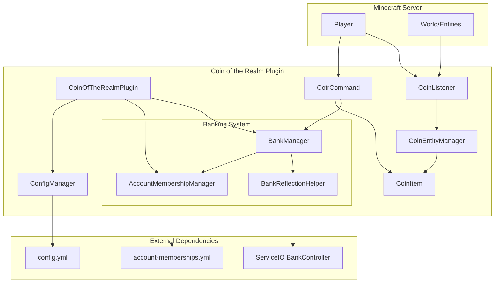
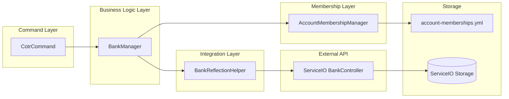
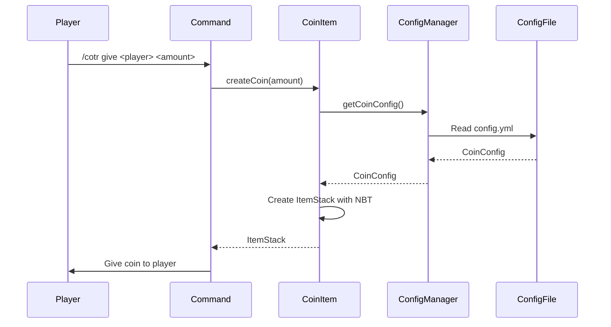
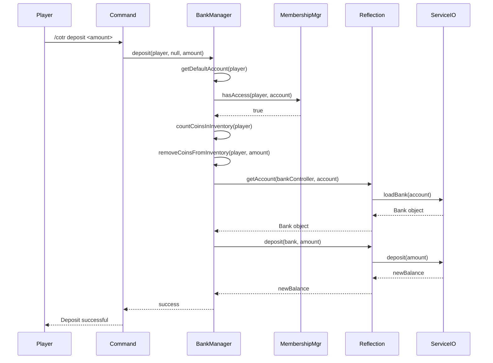
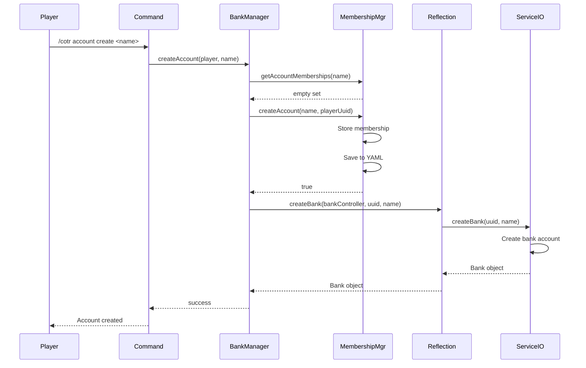
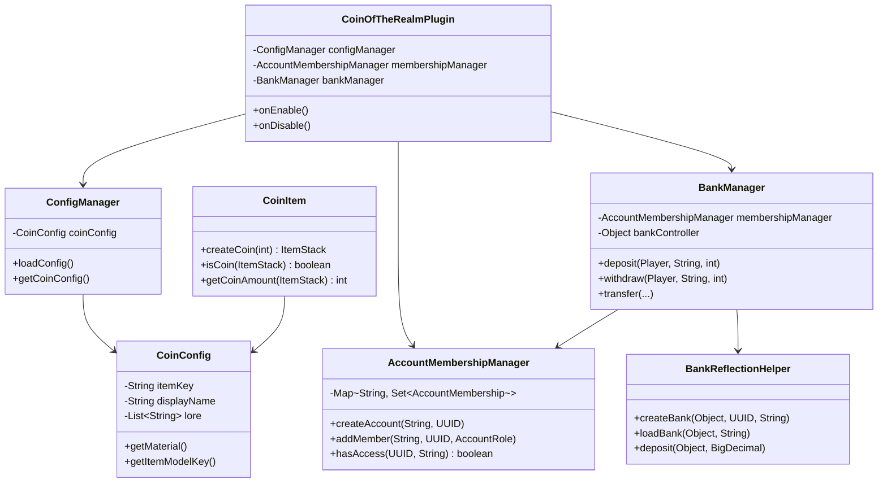

# Architecture Documentation

This document describes the architecture and design of the Coin of the Realm plugin, including component relationships, data flows, and system design decisions.

## System Overview

Coin of the Realm is a modular Minecraft plugin that provides a configurable currency system with optional banking features. The plugin is designed with clear separation of concerns and uses reflection-based integration for optional dependencies.

## High-Level Architecture



## Core Components

### 1. CoinOfTheRealmPlugin

The main plugin class that coordinates all components.

**Responsibilities**:
- Plugin lifecycle management (onEnable, onDisable)
- Component initialization and coordination
- Command registration
- Event listener registration
- Proximity-based coin pickup system

**Key Dependencies**:
- ConfigManager
- AccountMembershipManager
- BankManager
- CoinListener
- CotrCommand

### 2. ConfigManager

Manages plugin configuration loading and validation.

**Responsibilities**:
- Loading and parsing `config.yml`
- Validating configuration values
- Providing access to coin and banking configuration
- Default configuration generation

**Key Classes**:
- `ConfigManager.java` - Main configuration manager
- `CoinConfig.java` - Coin configuration data class

### 3. CoinItem

Factory class for creating and identifying coin items.

**Responsibilities**:
- Creating coin ItemStacks with NBT identification
- Validating coin items
- Extracting coin amounts from ItemStacks

**Key Features**:
- NBT-based identification (`cotr:coin`)
- Resource pack support via item models
- Custom display name and lore

### 4. CoinEntityManager

Manages the visual representation of coins in the world.

**Responsibilities**:
- Converting coins to ItemDisplay entities
- Handling coin pickup from displays
- Managing inventory overflow

**Key Features**:
- Custom ItemDisplay entities for dropped coins
- Proximity-based pickup system
- Fallback to standard Item entities

### 5. CoinListener

Event handler for coin-related events.

**Responsibilities**:
- Intercepting coin drops to create custom displays
- Handling player interactions with coin displays
- Managing coin pickup events

### 6. CotrCommand

Command handler for all `/cotr` commands.

**Responsibilities**:
- Parsing command arguments
- Routing to appropriate handlers
- Physical coin operations
- Banking operations
- Account management

## Banking System Architecture

The banking system is a layered architecture that bridges ServiceIO's BankController with a custom many-to-many membership system.



### Banking Component Details

#### BankManager

Acts as the bridge between the command layer and the banking infrastructure.

**Responsibilities**:
- Account creation and deletion
- Deposit and withdrawal operations
- Balance queries
- Fund transfers
- Member management
- Access control validation

**Key Methods**:
- `createAccount()` - Creates new bank account
- `deposit()` - Deposits coins from inventory
- `withdraw()` - Withdraws coins to inventory
- `transfer()` - Transfers between accounts
- `getBalance()` - Queries account balance

#### AccountMembershipManager

Manages the many-to-many relationship between players and accounts.

**Responsibilities**:
- Storing account memberships
- Managing player-account relationships
- Role-based access control
- Persistence to YAML file

**Data Model**:
- `AccountMembership` - Links player UUID to account name with role
- `AccountRole` - Enum (OWNER, MEMBER, USER, CONTRIBUTOR, VIEWER)

**Storage**:
- In-memory: ConcurrentHashMap for fast lookups
- Persistent: YAML file (`account-memberships.yml`)

#### BankReflectionHelper

Reflection-based wrapper for ServiceIO's BankController API.

**Why Reflection?**:
- ServiceIO is an optional dependency
- Prevents ClassNotFoundException when ServiceIO isn't installed
- Allows graceful degradation when ServiceIO is missing

**Methods**:
- `createBank()` - Creates bank via ServiceIO
- `loadBank()` - Loads bank from ServiceIO
- `deleteBank()` - Deletes bank via ServiceIO
- `getBalance()` - Gets balance from ServiceIO
- `deposit()` - Deposits via ServiceIO
- `withdraw()` - Withdraws via ServiceIO

## Data Flow Diagrams

### Coin Creation Flow



### Banking Deposit Flow



### Account Creation Flow



## Component Relationships

### Class Dependency Graph



## Design Patterns and Principles

### 1. Reflection-Based Optional Dependencies

ServiceIO integration uses reflection to avoid hard dependencies:

- **Benefit**: Plugin can run without ServiceIO
- **Implementation**: `BankReflectionHelper` uses `Class.forName()` and `Method.invoke()`
- **Error Handling**: Graceful degradation when ServiceIO is missing

### 2. Many-to-Many Relationship Management

The banking system implements a custom many-to-many layer on top of ServiceIO's one-to-many model:

- **ServiceIO Limitation**: One owner per bank
- **Our Solution**: Custom membership system with roles
- **Storage**: Separate YAML file for memberships

### 3. Factory Pattern

`CoinItem` uses factory methods for coin creation:

- `createCoin(int)` - Creates coin with specified amount
- `createCoin()` - Creates single coin
- Centralized coin creation logic

### 4. Manager Pattern

Multiple manager classes coordinate related functionality:

- `ConfigManager` - Configuration management
- `BankManager` - Banking operations
- `AccountMembershipManager` - Membership management
- `CoinEntityManager` - Entity management

### 5. Event-Driven Architecture

Event listeners handle world interactions:

- `CoinListener` - Handles drop and pickup events
- Proximity-based pickup system
- Custom entity creation for dropped coins

## Data Models

### Coin Item Structure

```
ItemStack
├── Material: (from config, default: GOLD_NUGGET)
├── Amount: 1-64
├── ItemMeta
│   ├── DisplayName: (from config)
│   ├── Lore: (from config)
│   ├── ItemModel: (from config, namespace:key)
│   └── PersistentDataContainer
│       └── cotr:coin = true (NBT identifier)
└── Unbreakable: true
```

### Account Membership Structure

```yaml
accounts:
  account-name:
    owner: "player-uuid"
    members:
      - uuid: "player-uuid"
        role: "OWNER" | "MEMBER" | "VIEWER"
        joined: timestamp
```

### Account Role Hierarchy

```
OWNER
├── Can: deposit, withdraw, transfer, view balance
├── Can: add/remove members, delete account
└── Full control

MEMBER
├── Can: deposit, withdraw, transfer, view balance
└── Cannot: manage members, delete account

USER
├── Can: deposit, withdraw (with daily limits), view balance
└── Cannot: manage members, delete account
└── Daily limits: Configurable per account or globally

CONTRIBUTOR
├── Can: deposit (unlimited), view balance
└── Cannot: withdraw, manage members, delete account
└── Perfect for: guild dues, donation accounts, kingdom contributions

VIEWER
└── Can: view balance only
```

## Storage Architecture

### Configuration Storage

- **File**: `plugins/CoinOfTheRealm/config.yml`
- **Format**: YAML
- **Loaded**: On plugin startup
- **Reloaded**: On server restart (or plugin reload)

### Membership Storage

- **File**: `plugins/CoinOfTheRealm/account-memberships.yml`
- **Format**: YAML
- **Loaded**: On plugin startup
- **Saved**: On membership changes and plugin shutdown

### Bank Data Storage

- **Managed by**: ServiceIO
- **Location**: ServiceIO's storage backend
- **Format**: ServiceIO-specific
- **Access**: Via BankController API

## Threading Model

### Synchronous Operations

- Command execution (Bukkit main thread)
- Event handling (Bukkit main thread)
- Configuration loading (plugin initialization thread)

### Asynchronous Operations

- ServiceIO API calls return `CompletableFuture`
- Bank operations are non-blocking
- Account creation/loading is asynchronous

### Thread Safety

- `AccountMembershipManager` uses `ConcurrentHashMap`
- Membership operations are thread-safe
- Bank operations handle async callbacks

## Extension Points

### For Developers

1. **CoinItem API**: Create and identify coins
2. **BankManager API**: Access banking functionality
3. **Event System**: Listen to coin-related events
4. **Configuration**: Extend config.yml structure

### For Integrations

1. **ServiceIO**: Banking backend (already integrated)
2. **Vault**: Potential future integration
3. **Other Economy Plugins**: Via CoinItem API

## Performance Considerations

### Optimizations

1. **In-Memory Caching**: Membership data cached in memory
2. **Lazy Loading**: Accounts loaded on demand
3. **Proximity Check**: Coin pickup runs every 5 ticks (not every tick)
4. **Reflection Caching**: Reflection methods cached after first call

### Scalability

- Membership system scales with number of accounts
- ServiceIO handles bank data persistence
- Coin operations are lightweight (ItemStack manipulation)

## Security Considerations

### Access Control

- Role-based access control (OWNER, MEMBER, USER, CONTRIBUTOR, VIEWER)
- Permission checks for all commands
- Account access validation before operations
- Daily transaction limits for USER role

### Data Integrity

- NBT-based coin identification prevents forgery
- Account membership validation
- Transaction validation (balance checks)

### Error Handling

- Graceful degradation when ServiceIO is missing
- Validation of all user inputs
- Safe fallbacks for invalid configurations

## Future Architecture Considerations

### Potential Enhancements

1. **Database Storage**: Replace YAML with database backend
2. **Transaction History**: Log all banking transactions
3. **Interest System**: Automatic interest on accounts
4. **Multi-Currency**: Support multiple coin types
5. **Vault Integration**: Direct Vault API support

### Design Decisions for Future

- Keep reflection-based integration pattern
- Maintain many-to-many membership system
- Preserve backward compatibility
- Modular design for easy extension

## Related Documentation

- [API Documentation](API.md) - Public API reference
- [Configuration Reference](CONFIGURATION.md) - Configuration details
- [Installation Guide](INSTALLATION.md) - Setup instructions
- [Development Guide](DEVELOPMENT.md) - Building the project
